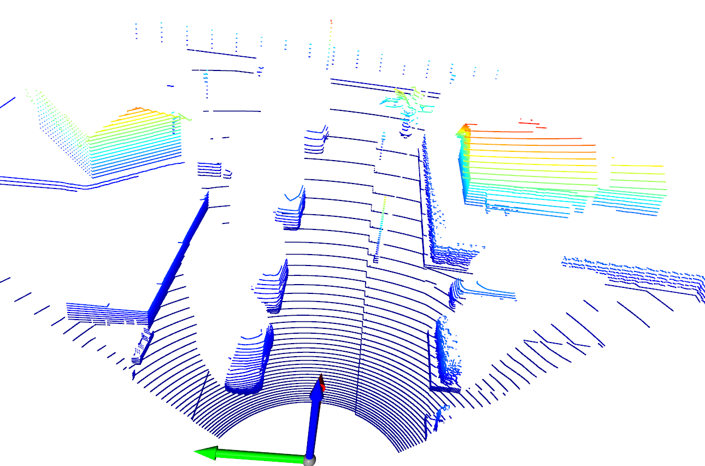

<p align="center">
  <a href="" rel="noopener">
 </a>
</p>

<h3 align="center">Point Cloud Object Detection Lab</h3>

<div align="center">

[]()
<!-- [](https://github.com/kylelobo/The-Documentation-Compendium/issues)
[](https://github.com/kylelobo/The-Documentation-Compendium/pulls)
[](/LICENSE) -->

</div>

---

 Forked from openpcdet, the original readme is in [here](./original_readme.md).


## 📝 Table of Contents

- [About](#about)
- [Prerequisites & Installing](#prerequisites--installing)
- [Getting Started](#getting_started)
<!-- - [Getting Started](#getting_started)
- [Deployment](#deployment)
- [Usage](#usage)
- [Built Using](#built_using)
- [TODO](../TODO.md)
- [Contributing](../CONTRIBUTING.md)
- [Authors](#authors)
- [Acknowledgments](#acknowledgement) -->

## 🧐 About <a name = "about"></a>

A code repository forked from openpcdet, I use it for my research and practice.
I will record my experiments about LiDAR point cloud object detection here.


## Prerequisites & Installing

See [official document](./docs/INSTALL.md) or [INSTRUCTION.md](./docs/INSTRUCTION.md).


## 🏁 Getting Started <a name = "getting_started"></a>
Just see [INSTRUCTION.md](./docs/INSTRUCTION.md).

<!-- These instructions will get you a copy of the project up and running on your local machine for development and testing purposes. See [deployment](#deployment) for notes on how to deploy the project on a live system. -->


<!-- ## 🔧 Running the tests <a name = "tests"></a>

Explain how to run the automated tests for this system.

### Break down into end to end tests

Explain what these tests test and why

```
Give an example
```

### And coding style tests

Explain what these tests test and why

```
Give an example
```

## 🎈 Usage <a name="usage"></a>

Add notes about how to use the system.

## 🚀 Deployment <a name = "deployment"></a>

Add additional notes about how to deploy this on a live system.

## ⛏️ Built Using <a name = "built_using"></a>

- [MongoDB](https://www.mongodb.com/) - Database
- [Express](https://expressjs.com/) - Server Framework
- [VueJs](https://vuejs.org/) - Web Framework
- [NodeJs](https://nodejs.org/en/) - Server Environment

## ✍️ Authors <a name = "authors"></a>

- [@kylelobo](https://github.com/kylelobo) - Idea & Initial work

See also the list of [contributors](https://github.com/kylelobo/The-Documentation-Compendium/contributors) who participated in this project.

## 🎉 Acknowledgements <a name = "acknowledgement"></a>

- Hat tip to anyone whose code was used
- Inspiration
- References -->
